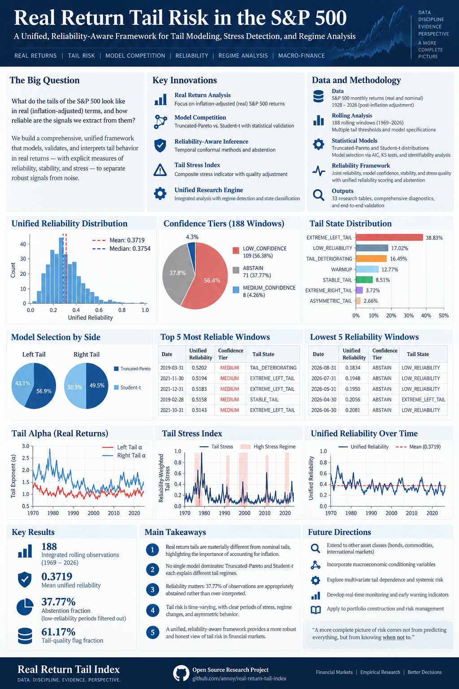
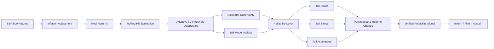

<div align="center">

# Real-Return Tail Index Estimation with the Hill Estimator

### A Reliability-Aware Framework for Dynamic Tail Estimation, Model Validity, Stress Detection, and Regime Analysis

[](https://www.python.org/)
[](https://doi.org/10.1214/aos/1176343247)
[](https://github.com/Rattandeep0500/real-return-tail-index)
[](https://github.com/Rattandeep0500/real-return-tail-index)
[](https://github.com/Rattandeep0500/real-return-tail-index)

**Estimating a tail is not enough. The real question is whether the estimate is trustworthy.**

[Research Paper](#research-paper) · [Methodology](#methodology) · [Empirical-results](#empirical-results) · [Reproducibility](#reproducibility) · [Limitations](#limitations)

</div>

---

## Research Overview

<p align="center">
  
</p>

This project develops an end-to-end research framework for **dynamic tail-risk analysis of inflation-adjusted S&P 500 returns**. The starting point is the classical Hill estimator; the research then adds threshold diagnostics, bootstrap uncertainty, tail-model validity, model competition, conformal uncertainty, temporal-dependence-aware calibration, tail asymmetry, stress measurement, dynamic states, persistence, regime-change analysis, and explicit abstention.

The goal is deliberately broader than estimating a single tail index:

> **When tail evidence becomes unstable, ambiguous, or weakly supported, the system should be able to say so.**

---

## Why This Research?

Extreme-value methods are useful because ordinary mean/variance summaries do not adequately describe rare financial losses and gains. But tail estimation itself is fragile: the result depends on the threshold, the effective number of extreme observations, the underlying tail model, finite-sample behavior, and temporal dependence.

This project treats those issues as first-class research objects.



---

# Research Questions

### Primary question

> How can extreme downside and upside tail behavior be estimated dynamically while explicitly accounting for estimator uncertainty, threshold selection, tail-model validity, temporal dependence, model ambiguity, and periods in which the evidence is too weak to justify a confident conclusion?

### Secondary questions

- Does inflation adjustment materially change inferred tail behavior?
- How stable are Hill estimates across thresholds and time?
- Can estimator uncertainty and Pareto validity be quantified separately?
- Can conformal methods provide useful uncertainty under heavy tails and dependence?
- Is tail-model family identification reliable in small rolling samples?
- Are left and right tails systematically asymmetric?
- Do tail states contain incremental predictive information beyond volatility?
- When should the system abstain rather than over-interpret a tail estimate?

---

# Dataset

| Component | Specification |
|---|---|
| Market | S&P 500 Index (`^GSPC`) |
| Frequency | Monthly |
| Inflation | FRED `CPIAUCSL` |
| Inflation source | U.S. Bureau of Labor Statistics via FRED |
| Market observations | 319 |
| CPI observations | 318 |
| Aligned real-return observations | 307 |
| Aligned period | January 2001 – August 2026 |
| Rolling window | 120 months |
| Rolling observations | 188 |

### Real-return construction

The project uses

$$
r^{real}_t = \frac{1+r^{nominal}_t}{1+\pi_t}-1
$$

and equivalently

$$
\log(1+r^{real}_t)=\log(1+r^{nominal}_t)-\log(1+\pi_t).
$$

### Descriptive statistics

| Metric | Nominal | Real |
|---|---:|---:|
| Mean return | 0.006640 | 0.004512 |
| Standard deviation | 0.043598 | 0.043514 |

The project explicitly compares nominal and real tails because inflation adjustment can change the apparent severity and direction of tail behavior.

---

# Methodology

## 1. Hill Tail-Index Estimation

For a positive tail, the Hill estimator is

$$
\frac{1}{\hat{\alpha}_k}=
\frac{1}{k}\sum_{i=1}^{k}
\left[\log X_{(n-i+1)}-\log X_{(n-k)}\right].
$$

For the left tail, negative returns are converted into positive loss magnitudes.

The project treats **$k$ as a research parameter**, not as an innocuous implementation detail: too small a $k$ increases variance, while too large a $k$ can introduce bias by moving away from the extreme tail.

## 2. Dynamic Rolling Engine

The real-return engine uses:

- Window: **120 months**
- $k_{min}$: **10**
- $k_{max}$: **80**
- $k$ step: **5**
- Rolling observations: **188**

Both left- and right-tail behavior are tracked through time.

## 3. Estimator Reliability

The calibrated reliability model uses:

- `alpha_hat`
- `bootstrap_std`
- `bootstrap_cv`
- `local_cv`
- `local_slope`
- `local_curvature`
- `k_fraction`

This separates **what the tail estimate says** from **how much confidence should be attached to it**.

## 4. Tail-Model Validity

The validity layer evaluates:

- Pareto KS distance
- Pareto log-likelihood
- threshold stability
- bootstrap Hill stability
- mean-excess fit
- validity score
- validity classification

The selected tail threshold is constrained by

$$k/n \leq 0.50.$$

A Pareto smoke test produced:

| Diagnostic | Result |
|---|---:|
| Selected $k$ | 50 |
| $\hat\alpha$ | 3.781206 |
| Pareto KS | 0.067850 |
| Bootstrap CV | 0.157996 |
| Threshold stability | 0.099108 |
| Mean-excess $R^2$ | 0.719277 |
| Validity score | 0.666428 |
| Classification | **UNCERTAIN** |

This illustrates an important principle: a low KS distance alone does not establish that a financial tail estimate is trustworthy.

## 5. Tail-Model Competition

Models evaluated:

- Pareto
- Lognormal
- Student-t
- Truncated Pareto

The truncated Pareto was correctly treated as a **two-parameter model**: tail index plus upper endpoint.

## 6. Conformal Uncertainty

The project compares:

- Global conformal calibration
- Adaptive conformal calibration
- Block conformal calibration

The temporal-dependence experiment shows why coverage calibration cannot be treated as an IID-only problem.

## 7. Tail Asymmetry

Tail asymmetry is defined as

$$
A_t=\frac{\alpha_R-\alpha_L}{\alpha_R+\alpha_L}.
$$

Positive values indicate a heavier left tail.

## 8. Reliability-Weighted Tail Stress

The Tail Stress Index is

$$
TSI_t=R_t\left[0.50S_{\alpha,t}+0.20S_{A,t}+0.30S_{\sigma,t}\right].
$$

The severity components are based on expanding historical information to avoid future leakage.

## 9. Dynamic Tail States

The framework uses:

- `LOW_RELIABILITY`
- `STABLE_TAIL`
- `TAIL_DETERIORATING`
- `EXTREME_LEFT_TAIL`
- `EXTREME_RIGHT_TAIL`
- `ASYMMETRIC_TAIL`
- `WARMUP`

## 10. Unified Reliability Engine

The unified signal is

$$
U_t=
0.45R_{joint,t}+
0.25C_{model,t}+
0.20S_{stability,t}+
0.10Q_{stress,t}.
$$

The final research engine then maps the score to confidence tiers and permits explicit abstention.

---

# Empirical Results

## Real vs Nominal Tail Distortion

Across 3,730 rolling observations:

| Measure | Left Tail | Right Tail |
|---|---:|---:|
| Mean distortion | +0.093281 | -0.120912 |
| Median distortion | +0.118786 | -0.115743 |
| Mean absolute distortion | 0.166520 | 0.159574 |
| $|distortion| > 0.10$ | 67.0087% | 63.2156% |
| $|distortion| > 0.25$ | 15.8642% | 18.2298% |
| $|distortion| > 0.50$ | 4.4988% | 2.3143% |
| Real tail thicker | 18.5478% | 81.2018% |
| Real tail thinner | 81.4522% | 18.7982% |
| Mean real $\alpha$ | 1.389058 | 1.615851 |
| Mean nominal $\alpha$ | 1.295777 | 1.736762 |

Overall mean distortion is **-0.048155**, with mean absolute distortion **0.161933**.

At $k=30$:

- Left-tail distortion: **+0.070673**
- Right-tail distortion: **-0.110880**

### Interpretation

Inflation adjustment is not merely a preprocessing step. It can materially change inferred tail behavior, and the direction of the effect differs between the downside and upside tails.

---

## Tail Stability

Strict stability was defined as

$$KS\leq0.15$$

and

$$Bootstrap\ CV\leq0.25.$$

Results:

| Metric | Result |
|---|---:|
| Rolling observations | 188 |
| Candidate $k$ values | 15 |
| Surface rows | 2,820 |
| Mean stable fraction | 0.142934 |
| Supported windows | 32.9787% |
| Weak windows | 67.0213% |

Most windows therefore do **not** satisfy a strict joint stability criterion.

---

## Tail Asymmetry

| Classification | Count | Share |
|---|---:|---:|
| LEFT_HEAVIER | 52 | 27.66% |
| RIGHT_HEAVIER | 19 | 10.11% |
| SYMMETRIC | 117 | 62.23% |

Mean asymmetry is **0.050065**, while mean absolute asymmetry is **0.132112**.

A single scalar tail index therefore cannot fully describe directional tail behavior.

---

## Tail Stress

| Metric | Result |
|---|---:|
| Valid stress observations | 140 |
| Mean stress | 0.140463 |
| Median stress | 0.119767 |
| Mean raw stress | 0.404549 |
| Mean reliability | 0.367586 |

| Stress state | Count | Share |
|---|---:|---:|
| LOW | 18 | 12.8571% |
| MODERATE | 27 | 19.2857% |
| HIGH | 23 | 16.4286% |
| EXTREME | 72 | 51.4286% |

The Tail Stress Index is treated as a **diagnostic state variable**, not as a validated stand-alone forecast model.

---

## Tail Persistence

| Variable | Lag-1 | AR(1) | Half-life |
|---|---:|---:|---:|
| Left alpha | 0.850372 | 0.882251 | 5.5328 months |
| Right alpha | 0.502957 | 0.502463 | 1.0071 months |
| Minimum tail alpha | 0.769185 | — | 2.8515 months |
| Asymmetry | 0.621917 | — | 1.5032 months |

Reliability persistence is also asymmetric:

| Variable | Lag-1 | Half-life |
|---|---:|---:|
| Left model validity | 0.877985 | 5.3983 months |
| Right model validity | 0.681973 | 1.8103 months |
| Left joint reliability | 0.842349 | 4.0580 months |
| Right joint reliability | 0.691014 | 1.8766 months |
| Realized volatility | 0.987043 | 33.8637 months |

The left tail is substantially more persistent than the right tail in this sample.

---

# Predictive Evaluation

The tail-state system was evaluated using walk-forward logistic regression against a volatility baseline.

| Target | Model | ROC AUC | PR AUC | Brier |
|---|---|---:|---:|---:|
| 1m extreme | Tail-State | 0.621822 | 0.095303 | 0.150547 |
| 1m extreme | Volatility | 0.737395 | 0.195577 | 0.249983 |
| 1m severe | Tail-State | 0.567602 | 0.141132 | 0.168550 |
| 1m severe | Volatility | 0.594048 | 0.235531 | 0.249994 |
| 3m loss | Tail-State | 0.596732 | 0.349697 | 0.220944 |
| 3m loss | Volatility | 0.529735 | 0.280642 | 0.250008 |
| 6m loss | Tail-State | 0.477727 | 0.219140 | 0.233462 |
| 6m loss | Volatility | 0.519757 | 0.230763 | 0.250011 |

### Predictive conclusion

**No robust predictive superiority over the volatility baseline was established.**

This is a central empirical finding, not an implementation failure.

---

# Predictive Robustness

A moving-block bootstrap used:

- **5,000 repetitions**
- **6-month blocks**

| Target | Observed ΔAUC | 95% CI | P(ΔAUC > 0) |
|---|---:|---|---:|
| 1m extreme | -0.115466 | [-0.328998, 0.106061] | 0.145921 |
| 1m severe | -0.036352 | [-0.199401, 0.160004] | 0.385200 |
| 3m loss | +0.062092 | [-0.157021, 0.275411] | 0.682600 |
| 6m loss | -0.047619 | [-0.279601, 0.160151] | 0.297200 |

Overall mean ΔAUC is **-0.034336**.

- Positive comparisons: **1 / 4**
- Significantly positive: **0 / 4**
- Significantly negative: **0 / 4**

The evidence therefore does not support a claim of robust incremental predictive power.

---

# Tail-Model Identifiability

This project deliberately tests whether apparent model-selection wins are actually identifiable.

## 2,250-case validation

- 150 repetitions
- $n=120$
- $k \in \{20,30,40\}$

| True model | Exact recovery |
|---|---:|
| Pareto | 0.335556 |
| Truncated Pareto | 0.013333 |
| Lognormal | 0.940000 |
| Student-t | 0.000000 |

Overall selected model frequencies:

| Selected model | Frequency |
|---|---:|
| Lognormal | 0.841333 |
| Pareto | 0.149778 |
| Truncated Pareto | 0.008889 |

### 4,800-case identifiability study

Sample sizes: $n=500,1000,2000,5000$

Candidate $k$: 20, 40, 60, 80, 120, 160

| Model | Overall recovery |
|---|---:|
| Lognormal | 0.923958 |
| Pareto | 0.361458 |
| Student-t | 0.000000 |
| Truncated Pareto | 0.021875 |

### Scientific implication

**AIC-based categorical heavy-tail family selection is poorly identified in small rolling samples.**

The framework therefore treats model competition as an ambiguity diagnostic instead of blindly interpreting the selected model as ground truth.

---

# Temporal Dependence and Conformal Calibration

Synthetic dependence-aware validation compared global, adaptive, and block conformal methods.

| Method | Mean coverage | Mean absolute coverage gap |
|---|---:|---:|
| Block | 0.911469 | 0.083233 |
| Global | 0.864980 | 0.099769 |
| Adaptive | 0.818116 | 0.111608 |

By regime:

| Regime | Adaptive | Block | Global |
|---|---:|---:|---:|
| IID Pareto | 0.7709 | 0.8677 | 0.8322 |
| Persistent Tail | 0.8194 | 0.9257 | 0.8690 |
| Persistent Tail-Volatility | 0.8419 | 0.9347 | 0.8794 |
| Regime-Switch | 0.8403 | 0.9178 | 0.8793 |

**Block conformal provided the strongest empirical coverage-control behavior under dependence among the tested methods**, although interval width can increase.

---

# Dynamic Tail States

The state engine produced 188 rolling observations, including 24 warmup observations.

| State | Count |
|---|---:|
| EXTREME_LEFT_TAIL | 73 |
| LOW_RELIABILITY | 32 |
| TAIL_DETERIORATING | 31 |
| WARMUP | 24 |
| STABLE_TAIL | 16 |
| EXTREME_RIGHT_TAIL | 7 |
| ASYMMETRIC_TAIL | 5 |

The strongest persistence was observed for low-reliability and extreme-left-tail states.

---

# Regime-Change Analysis

The first regime-change detector was rejected because overlapping rolling windows generated excessive change signals.

A persistence-aware version was then implemented.

| Metric | Result |
|---|---:|
| Observations | 188 |
| Candidate points | 164 |
| Raw candidates | 89 |
| Confirmed changes | 67 |
| Raw candidate fraction | 0.542683 |
| Confirmed fraction | 0.408537 |
| Mean score | 1.779485 |
| Median score | 1.638003 |
| Maximum score | 2.8 |

Major change episodes cluster around:

- 2012-07 → 2012-12
- 2015-07 → 2015-12
- 2018-03 → 2018-12
- 2019-01 → 2019-04
- 2020-02 → 2020-11
- 2022-02 → 2022-10
- 2023-01 → 2023-12
- 2024-01 → 2024-04
- 2025-05 → 2025-06

These are interpreted as **change episodes**, not as 67 independent structural-break tests.

---

# Unified Reliability Engine

The final engine combines:

- dynamic Hill estimates
- estimator reliability
- tail-model validity
- model competition
- tail stability
- asymmetry
- stress
- tail states
- persistence
- regime-change information
- entropy
- abstention

### Final score distribution

| Metric | Result |
|---|---:|
| Observations | 188 |
| Mean unified reliability | 0.371876 |
| Median | 0.375367 |
| ABSTAIN | 71 (37.7660%) |
| LOW | 109 |
| MEDIUM | 8 |
| HIGH | 0 |
| Tail-quality flag fraction | 61.1702% |

The highest-scoring windows include:

| Date | Unified score | Tier | State |
|---|---:|---|---|
| 2019-03-31 | 0.520236 | MEDIUM | TAIL_DETERIORATING |
| 2021-11-30 | 0.519363 | MEDIUM | EXTREME_LEFT_TAIL |
| 2021-12-31 | 0.518275 | MEDIUM | EXTREME_LEFT_TAIL |

The lowest-scoring windows include:

| Date | Unified score | Tier | State |
|---|---:|---|---|
| 2026-08-31 | 0.183415 | ABSTAIN | LOW_RELIABILITY |
| 2026-07-31 | 0.194823 | ABSTAIN | LOW_RELIABILITY |
| 2026-05-31 | 0.195016 | ABSTAIN | LOW_RELIABILITY |

The system therefore refuses to manufacture confidence during weak-evidence periods.

---

# Reliability–Coverage / Abstention Frontier

At a reliability threshold of **0.45**:

- Retained windows: **53**
- Coverage: **0.2834**
- Abstention: **0.7166**
- Mean next-alpha change: **0.166225**
- Baseline: **0.229186**

This represented approximately **27.5% lower mean next-alpha change** among retained observations in that comparison.

The frontier was non-monotonic, and severe-loss rates did not improve monotonically with the threshold. The evidence therefore supports abstention primarily as an **evidence-quality mechanism**, not as a guaranteed predictive filter.

---

# Joint Tail Reliability

Final experiment:

- Calibration observations: **30,000**
- Test observations: **2,100**
- Global conformal radius: **0.551944**
- Overall coverage: **0.882500**

| Component | ROC AUC | PR AUC |
|---|---:|---:|
| Model validity | 0.520629 | 0.742138 |
| Uncertainty | 0.702861 | 0.797441 |
| Joint | 0.664989 | 0.771963 |

A naive multiplication of uncertainty and model-validity scores did not improve reliability discrimination over the uncertainty component alone.

---

# Reliability Validation

Initial synthetic validation:

| Metric | Result |
|---|---:|
| Brier score | 0.128645 |
| ROC AUC | 0.844930 |
| Precision @ 0.80 | 0.887993 |

A later validity-aware version produced:

| Metric | Result |
|---|---:|
| Brier score | 0.224667 |
| ROC AUC | 0.652861 |

The later result is more conservative. The project therefore avoids describing reliability as perfectly calibrated or distribution-free.

---

# Main Findings

### What worked

- Real-return tails differ materially from nominal-return tails.
- Tail thickness is strongly time-varying.
- Left-tail alpha exhibits substantial persistence.
- Tail asymmetry contains information beyond a single scalar tail index.
- Tail-model validity changes through time.
- Strict stability diagnostics reject many rolling windows.
- Conformal methods provide useful uncertainty quantification.
- Block conformal calibration performs comparatively well under dependence.
- Explicit abstention provides a principled evidence-quality mechanism.
- A unified engine can integrate heterogeneous tail diagnostics.

### What did not work

- The tail-state system did not consistently outperform volatility.
- Predictive superiority was not statistically robust under moving-block bootstrap.
- Categorical heavy-tail family selection was poorly identifiable in small windows.
- Naive joint reliability multiplication did not improve over uncertainty alone.
- Adaptive conformal calibration did not guarantee conditional coverage in all regimes.
- Reliability did not exhibit a monotone relationship with future severe losses.

These negative findings are part of the contribution: they identify where apparently sophisticated tail systems can still fail.

---

# Scientific Positioning

This project does **not** claim to invent the Hill estimator.

It also does **not** claim that a single distribution, tail state, or reliability score universally predicts financial crashes.

The contribution is the integration and empirical evaluation of a **reliability-aware dynamic tail workflow** that explicitly separates:

```text
Tail Thickness
      +
Estimator Uncertainty
      +
Model Validity
      +
Threshold Stability
      +
Asymmetry
      +
Stress
      +
Temporal Dependence
      +
Model Ambiguity
      +
Persistence
      +
Abstention
      ↓
Evidence-Quality Layer for Tail Risk
```

A defensible one-sentence description is:

> **This study develops and empirically evaluates a reliability-aware framework for dynamic Hill-tail analysis in inflation-adjusted financial returns.**

---

# Limitations

This research should be interpreted with several constraints in mind:

- The core real-return dataset contains only **307 aligned monthly observations**.
- Extreme-value inference is intrinsically sample-hungry.
- Rolling windows overlap.
- Financial returns exhibit dependence, volatility clustering, and non-stationarity.
- Threshold selection remains a source of finite-sample uncertainty.
- Structural breaks can complicate interpretation.
- CPI and financial-return timing is imperfectly synchronized.
- Conformal guarantees depend on assumptions that may not hold exactly under dependent financial data.
- Rare-event AUC and PR-AUC estimates can be unstable.
- The unified reliability score is an engineered research construct, not a standardized industry statistic.
- The model-competition experiments demonstrate substantial identifiability limitations.
- The framework is not presented as production-ready regulatory VaR/ES infrastructure.

---

# Reproducibility

## Core research scripts

```text
experiments/
└── real_data/
    ├── dynamic_tail_engine.py
    ├── dynamic_tail_states.py
    ├── tail_stability_surface.py
    ├── tail_asymmetry.py
    ├── tail_stress_index.py
    ├── tail_model_competition.py
    ├── tail_memory_persistence.py
    ├── tail_state_regime_change.py
    ├── tail_state_entropy.py
    ├── unified_reliability_signal.py
    ├── unified_tail_research_engine.py
    └── final_end_to_end_audit.py

src/
└── tail/
    ├── calibration.py
    ├── adaptive_conformal.py
    └── tail_fit_diagnostics.py
```

## Generated research outputs

The analysis produces diagnostic tables under `tables/` and figures under `figures/` when the experiment scripts are executed.

The repository intentionally ignores generated research outputs by default to keep the source tree lightweight. The publication-facing overview image is stored separately under `docs/assets/`.

## Environment

```powershell
python -m venv .venv
.\.venv\Scripts\Activate.ps1
pip install -r requirements.txt
```

Run a key analysis with:

```powershell
python .\experiments\real_data\unified_tail_research_engine.py
```

Run the final computational audit with:

```powershell
python .\experiments\real_data\final_end_to_end_audit.py
```

---

# Final Computational Audit

The completed pipeline passed the final end-to-end computational audit:

```text
FINAL END-TO-END AUDIT

Overall status: PASS
Total checks: 164
PASS: 162
FAIL: 0
WARNING: 0
INFO: 2

AUDIT COMPLETED
```

The audit checks structural and computational integrity such as file presence, expected rolling-window counts, required columns, chronology, temporal alignment, numerical finiteness, score bounds, model-selection completeness, and unified-score logic.

> **A passing software audit verifies computational integrity; it does not establish universal statistical validity.**

---

# Repository Structure

```text
real-return-tail-index/
├── data/
│   ├── metadata/
│   ├── processed/
│   └── raw/
├── docs/
│   └── assets/
│       └── research-overview.png
├── experiments/
│   └── real_data/
├── src/
│   └── tail/
├── tests/
├── .gitignore
├── README.md
└── requirements.txt
```

---

# References

1. Hill, B. M. (1975). *A Simple General Approach to Inference About the Tail of a Distribution*. The Annals of Statistics, 3(5), 1163–1174. https://doi.org/10.1214/aos/1176343247

2. Embrechts, P., Klüppelberg, C., & Mikosch, T. (1997). *Modelling Extremal Events for Insurance and Finance*. Springer. https://doi.org/10.1007/978-3-642-33483-2

3. Vovk, V., Gammerman, A., & Shafer, G. (2005). *Algorithmic Learning in a Random World*. Springer. https://doi.org/10.1007/b106715

4. Gibbs, I., & Candès, E. (2024). *Conformal Inference for Online Prediction with Arbitrary Distribution Shifts*. Journal of Machine Learning Research, 25, 1–36.

5. Nicolau, J., Rodrigues, P. M. M., & Stoykov, M. Z. (2023). *Tail index estimation in the presence of covariates: Stock returns' tail risk dynamics*. Journal of Econometrics, 235(2), 2266–2284. https://doi.org/10.1016/j.jeconom.2023.04.002

6. Lederer, J., Sabourin, A., & Taheri, M. (2025). *Adaptive tail index estimation: minimal assumptions and non-asymptotic guarantees*. arXiv. https://doi.org/10.48550/arXiv.2505.22371

7. Danielsson, J., Ergun, L. M., de Haan, L., & de Vries, C. G. (2025 revision). *Tail Index Estimation: Quantile-Driven Threshold Selection*. SSRN.

8. Ivancevic, M., Nguyen, K. A., & Luo, Z. (2026). *Reliable value at risk estimation with conformal prediction*. Risk Management, 28, Article 59. https://doi.org/10.1057/s41283-026-00243-6

---

# Citation

```text
Deep, R. (2026). Real-Return Tail Index Estimation with the Hill Estimator:
A Reliability-Aware Framework for Dynamic Tail Estimation, Model Validity,
Stress Detection, and Regime Analysis. Research project.
```

**Repository:** https://github.com/Rattandeep0500/real-return-tail-index

---

# Final Takeaway

> **Tail-risk analysis should not stop at estimating alpha.**
>
> A robust research system must also determine whether the estimate is stable, whether a Pareto approximation is credible, how uncertain the estimator is, whether the signal persists, whether the tails are asymmetric, how much stress is present, whether competing models are identifiable, and when the evidence is too weak to support a confident conclusion.

This project turns those questions into an integrated, auditable research workflow.

---

<div align="center">

**Real Returns · Extreme Value Theory · Reliability · Tail Risk · Quantitative Finance**

Built as an empirical research framework, with both positive and negative results preserved.

</div>
